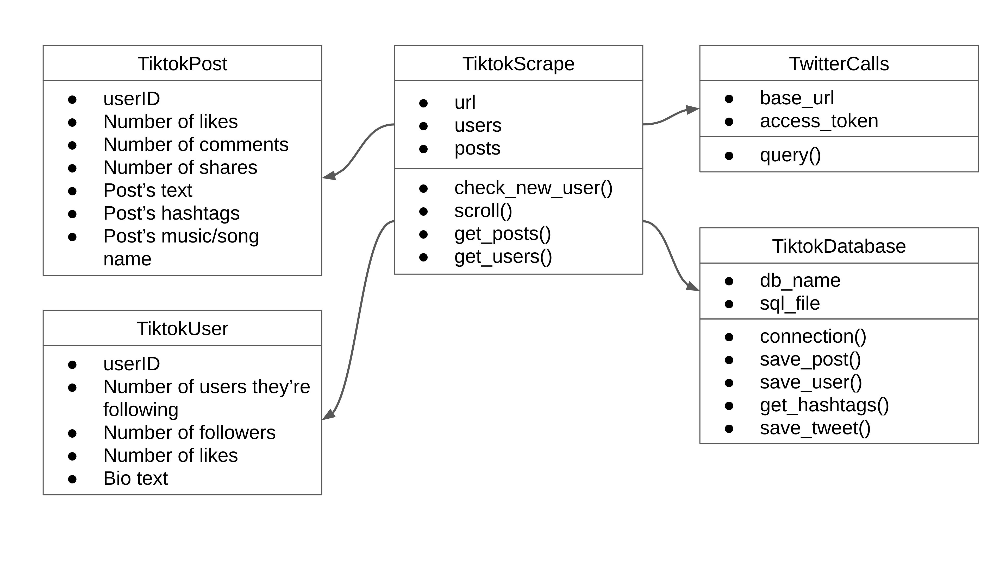
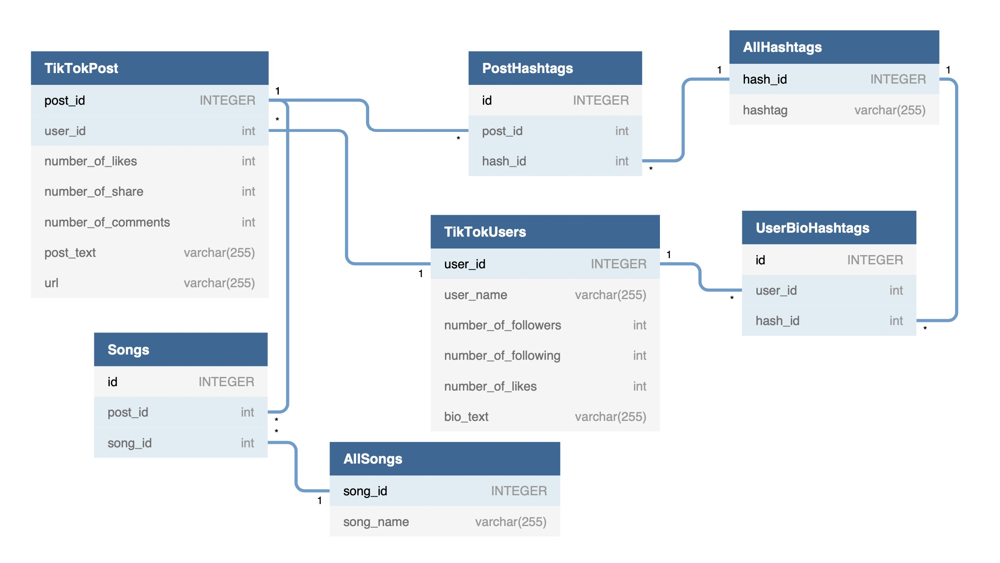

# 🥁  TikTokToe  🥁
## Exploring metadata on TikTok - Michael &amp; Tammuz project 👨🏻‍💻 👨‍💻
TikTok scrapper in the scope of the TikTokToe project. First project of the Fellows program of ITC<br/>
The following algorithm scrapes :<br/>
  • Posts in the TikTok trending page<br/>
  • User pages associated to each post<br/>
  
Moreover, it calls the twitter API per hashtag scrapped in TikThok posts

---

TikTok is on amazing platform where individuals can upload highly entertaining videos like : 👇


<p align="center"></p>

---

## 🛠  Install

```bash
pip install -r requirements.txt
```

## 🏃‍♂️  Usage

```bash
python3 tiktoktoe_scrapping.py [-h] [-p] [-f] [-l] [-he] [-s [SCROLL_NB]]

optional arguments:
  -h, --help            show this help message and exit
  -f, --flush_db        Reinitialize the DB before scrapping
  -l, --print_logs      Print logs while scrapping
  -he, --headless       Scrape headless
  -s [SCROLL_NB], --scroll_nb [SCROLL_NB] Number of scrolls
```

## 👨‍🎓 Classes
<p align="center"></p>


## 👨‍🎓 SQL Database
<p align="center"></p>

## 🔌 Third Party Plugins

* [Selenium](https://selenium-python.readthedocs.io/) - Provides a simple API to write functional/acceptance tests using Selenium WebDriver.
* [SQLite3](https://docs.python.org/3/library/sqlite3.html) - Interface for SQLite databases.
* [Twitter API](https://developer.twitter.com/en) - Twitter API

## 📫 Posts
Explore the hidden metadata behind each post by scrapping from the most popular posts the: 
  - postID  
  - userID
  - Number of likes
  - Number of comments
  - Number of shares
  - Post's text
  - Post's hashtags
  - Post's music/song name
<p align="center"></p>

---

## 👨‍👩‍👧‍👦 Users
Explore the metadata of each user by storing their
  - userID
  - Numbers of users they're following
  - Number of followers
  - Number of likes
  - Bio text
<p align="center"></p>

---

## 🤏 Scrolling
<p align="center"></p>
