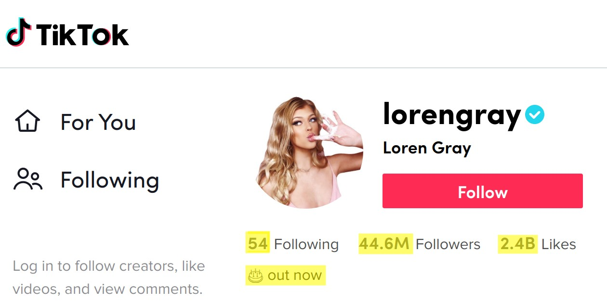

# TikTokToe
## Exploring metadata on TikTok
### Michael &amp; Tammuz project

TikTok is on amazing platform where individuals can upload highly entertaining videos like:

## Posts
Explore the hidden metadata behind each post by scrapping from the most popular posts the: 
  - postID  
  - userID
  - Number of likes
  - Nubmber of comments
  - Number of shares
  - Post's text
  - Post's hashtags
  - Post's music/song name

## Users
Explore the metadata of each user by storing their
  - personID
  - Numbers of users they're following
  - Number of follwers
  - Number of likes
  - Bio text

## Scrolling

### Technical stuff.. 
# Additional To Do:
  - add OOP / classes to code **STORED IN CLASSES
Implement the scraper with Selenium.

# Future work:
- Add scrapping of comments
- Sentiment analysis on text
